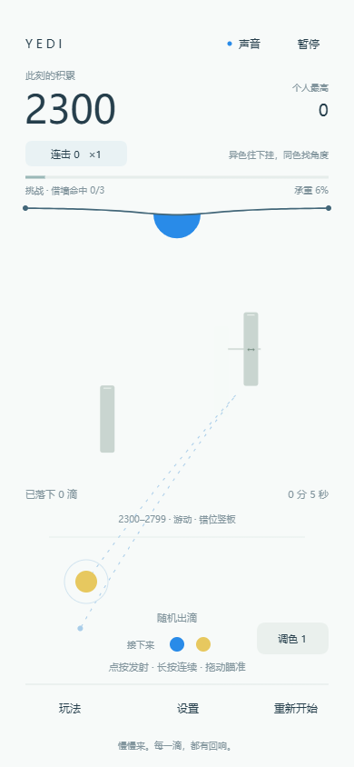

# 解压液滴小游戏

一个以**手机竖屏触控**为主、无关卡、无倒计时的液滴解压小游戏，提供**网页版**和**Android APK**。清爽平面画面，随机出滴、左右反弹、三原色混合、异色黏连、多点悬挂、颈缩、断裂与膜线回弹，搭配黏性液体音效。

当前版本 **1.3.2 · 拖动与音量修复版**，项目代号 YEDI。游戏使用 JavaScript / Canvas 2D；安卓版以轻量 WebView 外壳内置同一套游戏与音效，无需账号或后台服务。

## 直接游玩 / 下载

| 方式 | 入口 | 说明 |
| --- | --- | --- |
| 手机网页版 | [点这里直接玩](https://playnn1.github.io/jieya-yedi-xiaoyouxi/) | Android、iPhone 均可用浏览器打开，推荐竖屏；电脑也可鼠标试玩 |
| Android APK | [下载最新版安装包](https://github.com/PLAYNN1/jieya-yedi-xiaoyouxi/releases/latest/download/jieya-yedi-v1.3.2.apk) | Android 8.0 及以上，内置资源，安装后离线游玩 |
| 全部发布文件 | [Releases](https://github.com/PLAYNN1/jieya-yedi-xiaoyouxi/releases) | APK、校验文件和可自行部署的网页版压缩包 |

APK 是维护者签名的独立安装包，按 Android 提示允许浏览器或文件管理器安装此来源即可。iPhone 请使用网页版。安装包构建和签名已检查，尚未进行 Android 真机验收。

两种版本的最高分分别保存在各自设备与应用中，不自动同步；卸载或清除应用数据会清除安卓版记录。网页版首次打开需联网，APK 游玩不需要联网权限。



## 本地运行源码

安装 Node.js 后，在工程目录运行：

```sh
npm run preview
```

浏览器打开 **http://127.0.0.1:4173**。不需要安装 npm 依赖。更新后请刷新页面。

双击 `index.html` 会受到浏览器对音频文件读取的限制，请使用本地预览服务。访客使用部署后的静态网页时不需要 Node.js、微信或任何安装步骤。

## 怎么玩

- 按住底部发射台左右拖动，发射台实时跟手移动，没有拖动死区；按到发射台边缘也不会跳动。按住期间不发射，松手只射出一滴。点按发射区并松手也能直射。
- 向上拖出发射区后，发射台停在选定位置，手指继续调整射击方向；也可以直接按住发射区上方瞄准。虚线展示左右墙壁和障碍反弹的预计轨迹，松手发射。移动挡板的轨迹按当前位置估计，实际飞行需考虑它的移动。
- 不设长按自动连发。切到后台、触摸取消或打开面板会取消当前手势，不会误发射；没有自动瞄准或追踪。
- 右上角“音量”打开 0–100% 音效滑块，松手试听，可单独静音或恢复；音量与静音会自动保存。默认保持之前的音效响度。
- 小滴和脱落大滴碰到游戏画面左右两侧会反弹，保留 92% 的横向速度，继续受重力影响；小滴反弹后仍能撞击融合，并有短暂挤压反馈。屏幕底部不设反弹。
- 每次发射颜色随机给出，不能手动切换；发射位置显示当前待发颜色，下方预告后两滴。起初只有蓝、黄、红，调色得到的绿、紫、橙会逐步进入本场随机队列。只有实际射出后才推进队列。
- 同色融合；普通异色命中会挂到被命中液滴的下方，各自保持轮廓、颜色和质量。例如蓝滴接住红滴后，红滴在蓝滴下面，下一发直射先撞红滴，不能穿透去接触蓝滴。可以换位置、拖动角度或借墙绕过遮挡。
- 液滴构成真正的悬挂分支，而不是一个轮廓内部的色条。每个节点独立增重、形变与颈缩；上层断裂会带落整支后代，下层单独断裂则保留上层。根部脱落后留下少量种子液体。最多 64 个悬挂节点，最多 14 层；正常情况下会先遭遇拥挤压力。
- 三原色混合保留为主动的**调色技能**，不会普通命中就自动混合。点击“调色”或按 C，下一发可把两种不同三原色混合：蓝＋黄→绿、红＋黄→橙、红＋蓝→紫。射出即消耗，射偏或打到不兼容间色也会消耗。初始 1 次，最多 3 次；每累计落下 3 滴或完成循环挑战补充。再次点击或按 C 可在发射前取消。间色也可与同色间色融合；调色后若上下变成同色，会继续合并。
- 膜线的承重下陷、碰撞激起的上下波动、脱落后的回弹已加强，同时保留阻尼衰减。
- 每颗液滴独立承载、形变、摆动、拉长和颈缩，超过阈值断裂坠落，引发局部膜波。落下后剩余附着液体作为下一轮种子，可以一直继续。
- **承重压力**由总质量和悬挂深度共同决定。压力达到 100% 后，可继续思考，没有倒计时；此时再发射 3 滴而未缓解压力，会让最重的一支崩落，扣分并清空连击，随后继续游玩。及时清理能消除危险，练习模式不触发惩罚。
- **循环挑战**依次鼓励借墙命中、一次带落整支、成功调色；完成后奖励分数和 1 次调色。后续轮次略提高借墙与连带数量要求。它们是可选的高分目标，不是关卡或强制任务。

## 随机障碍

- 0–299 分自由熟悉操作；300–799 分出现一块障碍，800–1299 分换为两块，之后每提高 500 分重新随机布置。1300 分起可能出现缓慢横移挡板，2300 分起可出现三块组合。更多分数持续换场，不会进入最终关卡。
- 12 类布局包含短横板、方块、竖挡板、高低板、双方块、窄门、转角、错位竖板、板块组合、阶梯、三点绕射和回折通道；每场重新随机镜像、偏移和移动组合。后续布局保持两至三块，保留绕行空间，不无限增加数量。
- 新布局先显示至少 1.8 秒的虚线预告；实心障碍才参与碰撞。旧布局在新布局安全就位后退出。预告位置如果与悬挂液体或在途液滴重叠，会等待让开；持续被悬挂分支占用则重新寻找布局。不会凭空生成在液滴体内。
- 横板拦直射、竖板折转方向、方块提供多面反弹，圆角碰撞按接触方向反射。瞄准可串联墙壁与挡板；借板不消耗调色次数。脱落大滴也会反弹，并向挡板边缘弹落以进入回收区。
- 移动挡板接近悬挂分支时会停让。障碍没有伤害、没有独立倒计时；仍可随时停下来思考。
- 难度以**本场达到过的最高分**推进，超载扣分不会撤回障碍。重新开始会清空障碍进度。

## 计分

| 事件 | 得分 |
| --- | --- |
| 同色融合 | 10 × 当前倍率 |
| 异色向下悬挂或空位首次附着 | 2 分，异色悬挂中断融合连击 |
| 成功进行三原色组合混合 | 额外 5 分 |
| 相邻同色液滴自动合并 | 20 × 当前倍率 |
| 借墙反弹后成功命中 | 额外 10 分 |
| 借障碍反弹后成功命中 | 额外 15 分；同一发借至少两次障碍再加 10 分，可叠加借墙奖励 |
| 切断并脱落 | 50 × 当前倍率，每连带多 1 滴再加 25 分 |
| 高压力下主动清理 | 额外 75 分救场奖励 |
| 循环挑战 | 借墙 80 / 连带 120 / 调色 100 分，并补充调色 |
| 超载崩落 | 扣当前分数 15%，最低 30、最高 200 分；分数不低于 0 |
| 射偏 | 不扣分，仅重置连击与倍率 |

第 1–5 次连续融合为 ×1，第 6–10 次为 ×2，第 11–15 次为 ×3，第 16–20 次为 ×4，第 21 次起为 ×5。没有时间压力，停下来思考不会中断连击。因目标断裂而被打断的在途小滴不计作失误。堆积不是高分捷径，精准融合、借墙和连带清理得分更高。

最高分、音量与静音选择保存在当前浏览器的本地存储；重新开始时，最近五场计分记录也会保存。刷新会开始新的一场，最高分保留。没有账号、远程排行榜或跨设备同步；清除浏览器站点数据会清除纪录。浏览器禁用存储时仍可以正常游玩。

## 操作与设置

| 控件 / 键盘 | 功能 |
| --- | --- |
| 音量 | 打开 0–100% 滑块，松手试听，可静音或恢复，自动保存 |
| M | 快捷静音或恢复，保留之前调好的音量 |
| 暂停 / Escape | 冻结当前场景，随时继续 |
| 玩法 / H | 打开玩法与计分说明 |
| 设置 / P | 查看模式、最近记录与物理参数 |
| 重新开始 / R | 先确认，再重置本场；保留最高分 |
| 空格 | 发射或关闭说明后继续 |
| 调色 / C | 准备或取消下一发调色技能 |
| F | 显示/隐藏帧率，默认不显示 |

默认是**计分模式**，采用标准物理。设置中可选择**进入练习 · 重新开始**，自由调节脱落阈值、膜线张力、阻尼与小滴大小。练习可得分，但不写入个人最高和计分记录。切换模式会明确重新开始一场，避免把不同参数下的分数混入同一纪录。

切到后台会停止帧循环、声音和长按操作，回到页面不会快进模拟。前台保持的手动暂停不会被后台切换解除。支持手机触屏、鼠标和键盘，按窗口等比缩放；高分屏像素比限制为 2。

## 文件

```text
index.html / preview.html  网页入口（两者均可运行）
preview.js                 浏览器输入、本地存储、音效适配
src/simulation.js          多点膜线、液滴动力学、颜料及面积守恒
src/obstacles.js           分数段布局、随机障碍、预告与连续碰撞检测
src/session.js             分数、连击、倍率、本地纪录数据校验
src/renderer.js            轮廓绘制、计分界面、暂停/设置/说明
src/app.js                 拖台、松手发射、音量、模式及帧循环
src/audio-config.js        共用音效音量
audio/*.wav                本地液体音效与裁切源
tools/serve.js             本地预览服务
tools/build-web.js         构建可直接部署的静态网页
tools/make-audio.js         从现有裁切源重建声音
tests/                     基本模拟、计分和旧微信入口检查
android/                   Android 离线外壳、图标、Gradle 构建工程
tools/sync-android.js      将网页版与音效同步进 APK
tools/sign-android.js      使用本地私有签名密钥签名安装包
docs/android.md            安卓构建、签名与发布说明
game.js / game.json        保留的历史微信兼容入口
docs/wechat.md             历史微信原型说明
outputs/                   本地截图、检查记录、交付包
```

这是为解压手感编排的二维模型，不是完整流体求解器。悬挂节点采用独立的细颈液滴轮廓，保留真实遮挡关系；不采用共享轮廓内横向分色的旧表现。

## 构建与基本检查

```sh
npm test
npm run build
```

静态网站生成到 `dist/`，仅含网页所需文件。所有资源使用相对地址，支持 GitHub Pages 仓库子路径。Android 构建会自动同步此目录的游戏与音效，详见 [Android 构建说明](docs/android.md)。

推送到 main 时，GitHub Actions 自动检查并发布网页版，同时构建可供开发者检查的 debug APK。面向玩家的维护者签名安装包发布在 Releases；签名私钥不进入源码仓库。

本版做了基本逻辑检查，包括分数段换场、预告避让、快速小滴和圆角反弹、瞄准折返、借板奖励以及脱落液体的质量守恒；浏览器简短检查了障碍预告、实际点击发射反弹、换场、玩法说明和重置。没有进行完整设备兼容性或长时间人工验收。实际难度、手感与具体问题由后续试玩反馈调整。

## 许可与音效

软件代码采用 [MIT 许可](LICENSE)。音频与代码分开说明，见 [音效许可](audio/LICENSE.md)。音频来自维护者提供并确认可以公开再分发的参考录音，仓库只包含裁切样本和处理后的游戏音效。

Android 外壳依赖与构建工具的许可见 [第三方声明](THIRD_PARTY_NOTICES.md)。
